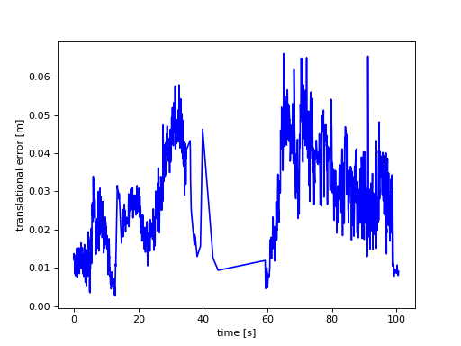
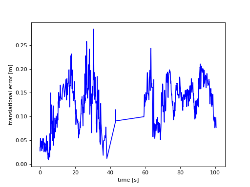

# vo_lstm

## Installation

```shell
$ pip3 install -r requirements.txt
```

## Dataset

The dataset employed in this Visual odometry demo is the [TUM dataset](https://cvg.cit.tum.de/data/datasets/rgbd-dataset/download). Specifically, the following sequences are used to train the model:

- [freiburg2_pioneer_360](https://cvg.cit.tum.de/rgbd/dataset/freiburg2/rgbd_dataset_freiburg2_pioneer_360.tgz)
- [freiburg2_pioneer_slam](https://cvg.cit.tum.de/rgbd/dataset/freiburg2/rgbd_dataset_freiburg2_pioneer_slam.tgz)
- [freiburg2_pioneer_slam2](https://cvg.cit.tum.de/rgbd/dataset/freiburg2/rgbd_dataset_freiburg2_pioneer_slam2.tgz)
- [freiburg2_pioneer_slam3](https://cvg.cit.tum.de/rgbd/dataset/freiburg2/rgbd_dataset_freiburg2_pioneer_slam3.tgz)

You have to download and extract the each sequence into the dataset/train directory.

## Train

First, configure the params to train the model. Check them in the [params.py](params.py) file. Then, run the training script.

```shell
$ python3 train.py
```

## Validation

The [TUM online validation tool](https://cvg.cit.tum.de/data/datasets/rgbd-dataset/online_evaluation) is used to validate the model. For this aim, the following sequences can be used. Download and extract this sequence into the dataset/val directory.

- [freiburg2_pioneer_360_validation](https://cvg.cit.tum.de/rgbd/dataset/freiburg2/rgbd_dataset_freiburg2_pioneer_360_validation.tgz)
- [freiburg1_room_validation](https://cvg.cit.tum.de/rgbd/dataset/freiburg1/rgbd_dataset_freiburg1_room_validation.tgz)
- [freiburg3_walking_rpy_validation](https://cvg.cit.tum.de/rgbd/dataset/freiburg3/rgbd_dataset_freiburg3_walking_rpy_validation.tgz)

Before using the validation tool, generate the position and orientations for the validation sequence. Then, upload the generated file and configure the validation tool setting the sequence length that is the frames per pose.

```shell
$ python3 val.py
```


## Results

Put your results here showing the graphs got from [TUM online validation tool](https://cvg.cit.tum.de/data/datasets/rgbd-dataset/online_evaluation).

---

# Resultado del alumno

Tras entrenar con los cuatro conjuntos de entrenamiento, para el conjunto de evaluacion (freiburg2_pioneer_360) se obtuvieron las siguientes salidas:

---

## Prueba1

#### Parametros:

##### LSTM
hidden_size = 512

num_layers = 1

bidirectional = False

lstm_dropout = 0.2

##### Dataset
sequence_length = 2

batch_size = 128

##### Train
learning_rate = 0.001

epochs = 5

#### Output:

compared_pose_pairs 1659 pairs

translational_error.rmse 0.030508 m

translational_error.mean 0.027809 m

translational_error.median 0.026598 m

translational_error.std 0.012545 m

translational_error.min 0.002649 m

translational_error.max 0.066030 m

rotational_error.rmse 1.323285 deg

rotational_error.mean 1.014853 deg

rotational_error.median 0.015463 deg

rotational_error.std 0.849209 deg

rotational_error.min 0.015456 deg

rotational_error.max 11.280195 deg

#### Imagen:



---

## Prueba2

#### Parametros:

##### LSTM
hidden_size = 512

num_layers = 2

bidirectional = True

lstm_dropout = 0.2

##### Dataset
sequence_length = 4

batch_size = 128

##### Train
learning_rate = 0.001

epochs = 5

#### Output:

compared_pose_pairs 1645 pairs

translational_error.rmse 0.132923 m

translational_error.mean 0.123242 m

translational_error.median 0.131100 m

translational_error.std 0.049799 m

translational_error.min 0.008945 m

translational_error.max 0.284050 m

rotational_error.rmse 3.599547 deg

rotational_error.mean 2.088153 deg

rotational_error.median 0.031909 deg

rotational_error.std 2.931954 deg

rotational_error.min 0.060502 deg

rotational_error.max 65.071054 deg

#### Imagen:


